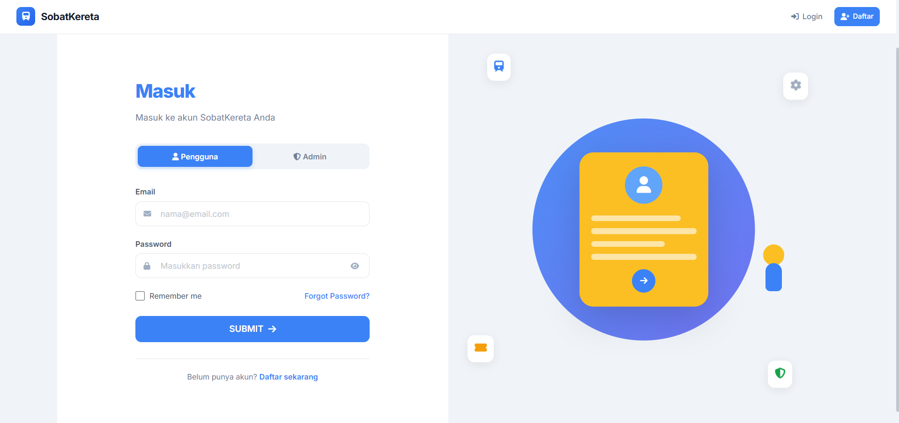
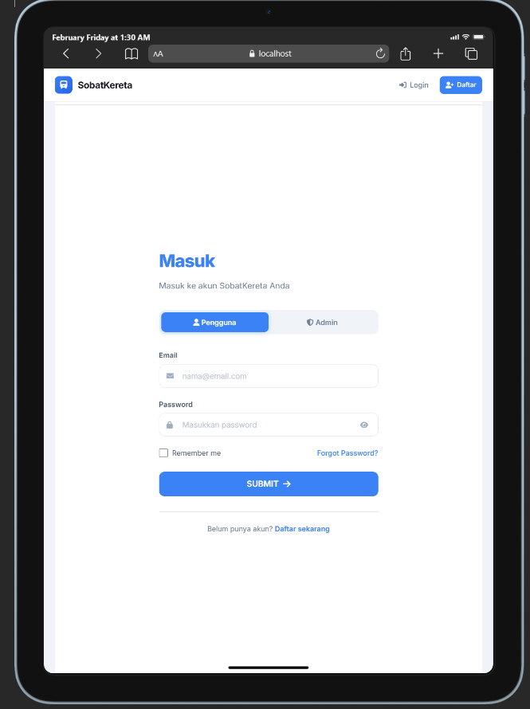
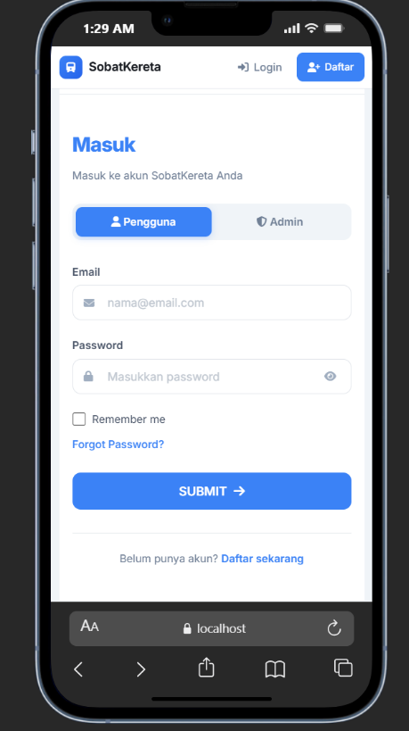
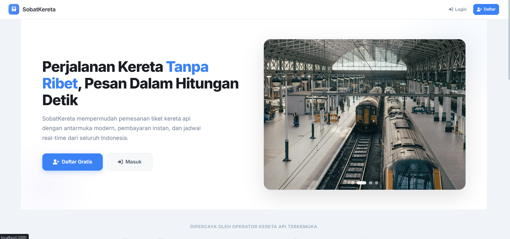
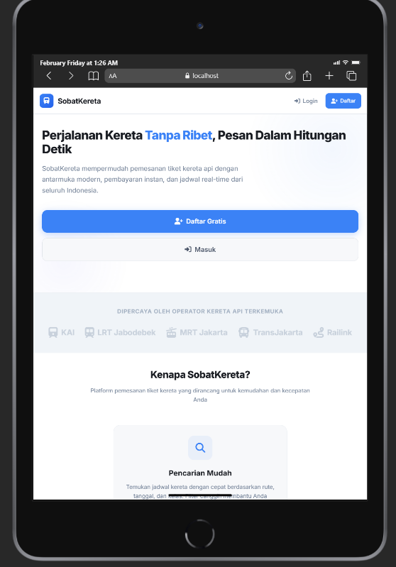
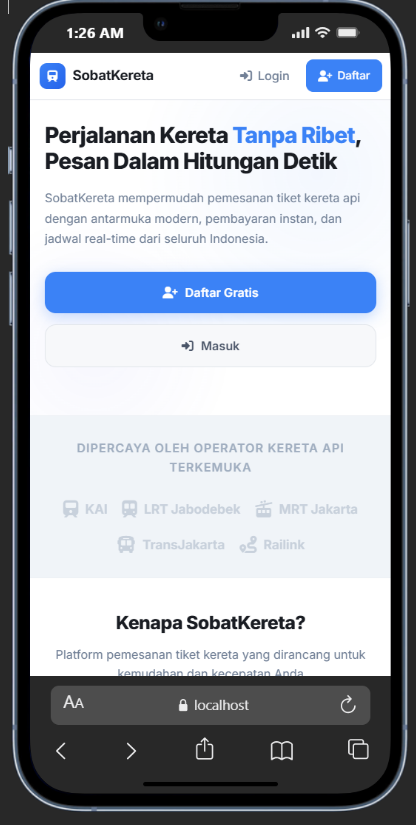
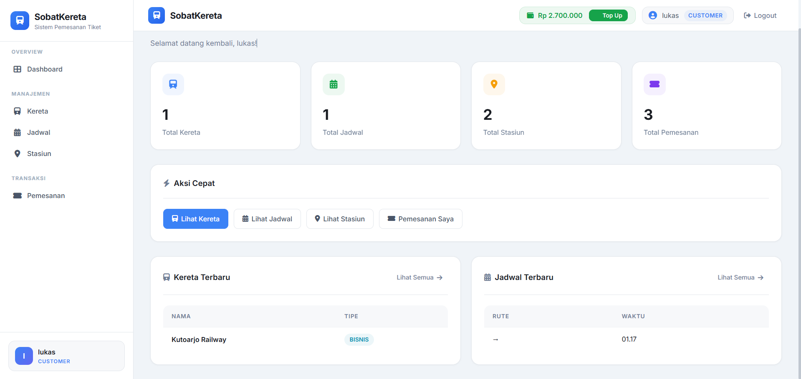
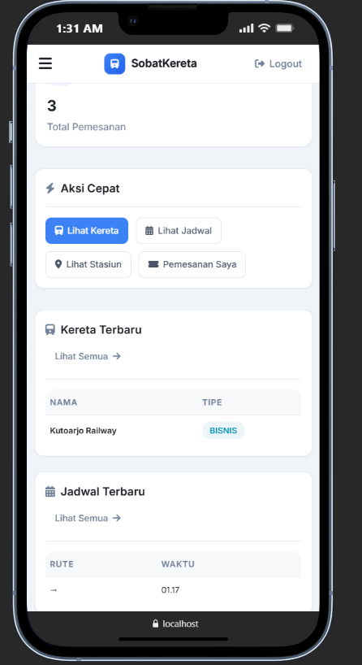
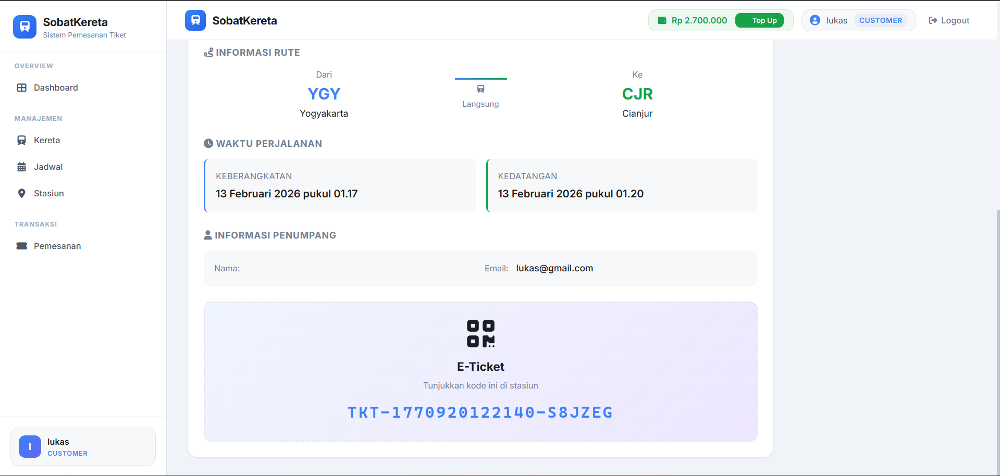
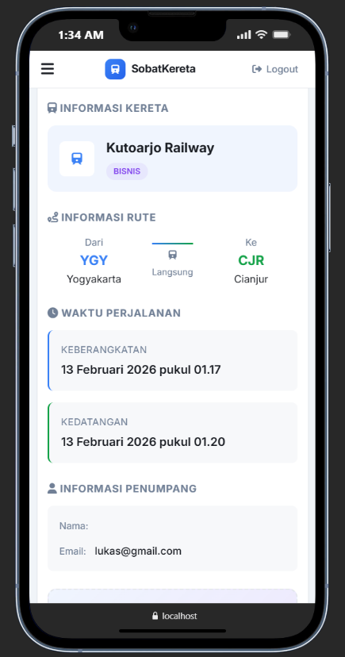

# SobatKereta 

<p align="center">
  
</p>

<p align="center">
  <strong>Fullstack Development Challenge @ DOT</strong>
</p>

<p align="center">
  
  
  
  
  
</p>

---

## Catatan Penting

> **Akun Bawaan (Seeded)**
>
> Aplikasi secara otomatis membuat akun berikut saat pertama kali dijalankan:
>
> | Role     | Email                 | Password | Saldo Awal   |
> |----------|-----------------------|----------|-------------|
> | Customer | `lukas@gmail.com`     | `user`   | Rp 500.000  |
> | Admin    | `admindot@admin.com`  | `Admin`  | -           |
>
> Admin memiliki akses penuh terhadap CRUD Kereta, Stasiun, dan Jadwal.  
> Customer hanya dapat melihat jadwal, melakukan pemesanan, dan mengelola tiket.

---

## Daftar Isi

- [Screenshots](#screenshots)
- [Persyaratan Sistem](#persyaratan-sistem)
- [Fitur yang Diimplementasikan](#fitur-yang-diimplementasikan)
- [Tech Stack](#tech-stack)
- [Arsitektur MVC di NestJS](#arsitektur-mvc-di-nestjs)
- [Struktur Proyek](#struktur-proyek)
- [Desain Database](#desain-database)
- [Cara Menjalankan](#cara-menjalankan)
- [Halaman & Endpoint](#halaman--endpoint)
- [Panduan Pengujian Manual](#panduan-pengujian-manual)
- [Asumsi & Keputusan Desain](#asumsi--keputusan-desain)
- [Video Demo](#video-demo)

---

## Screenshots

<details>
<summary><strong>Halaman Autentikasi (Login / Register)</strong></summary>
<br/>

| Desktop | Tablet | Mobile |
|---------|--------|--------|
|  |  |  |

</details>

<details>
<summary><strong>Homepage / Landing Page</strong></summary>
<br/>

| Desktop | Tablet | Mobile |
|---------|--------|--------|
|  |  |  |

</details>

<details>
<summary><strong>Dashboard / Main Page</strong></summary>
<br/>

| Desktop | Mobile |
|---------|--------|
|  |  |

</details>

<details>
<summary><strong>Booking Tiket</strong></summary>
<br/>

| Desktop | Mobile |
|---------|--------|
|  |  |

</details>

---

## Persyaratan Sistem

| Software         | Versi Minimum | Keterangan                       |
|------------------|---------------|----------------------------------|
| **Docker**       | 20.x+         | Wajib untuk menjalankan aplikasi |
| **Docker Compose** | 2.x+       | Orchestration container          |
| Node.js          | 20.x          | Hanya jika ingin run lokal       |
| npm              | 9.x+          | Hanya jika ingin run lokal       |

---

## Fitur yang Diimplementasikan

### Sesuai Persyaratan Tugas

| No | Persyaratan                                   | Status |
|----|-----------------------------------------------|--------|
| 1  | Admin panel dengan minimal 2 tabel + login    | Complete     |
| 2  | Relasi one-to-many antar tabel                | Complete     |
| 3  | Halaman list dan detail untuk setiap tabel    | Complete     |
| 4  | Fitur pencarian data                          | Complete     |
| 5  | Pola arsitektur MVC dengan NestJS             | Complete     |
| 6  | README dengan penjelasan proyek               | Complete     |
| 7  | Desain database / ERD                         | Complete     |
| 8  | Screenshot aplikasi                           | Complete     |
| 9  | Daftar dependencies                           | Complete     |
| 10 | Video demo                                    | *Incomplete*     |

### Fitur Tambahan (Bonus)

- **Autentikasi & Otorisasi** — Session-based auth dengan role (Admin/Customer)
- **Sistem Saldo & Pembayaran** — Top-up saldo, pembayaran tiket, refund otomatis
- **Booking System** — Kode booking unik (TKT-XXXXXX), manajemen status (PENDING → CONFIRMED / CANCELLED)
- **Journey Status Otomatis** — Status perjalanan kereta terupdate otomatis berdasarkan waktu
- **Refund Otomatis** — Pengguna mendapat refund saat admin menghapus/mengubah kereta atau jadwal
- **Responsive Design** — Desain profesional yang mendukung semua ukuran layar (mobile, tablet, desktop)
- **Docker Ready** — Satu perintah `docker-compose up` untuk menjalankan seluruh stack
- **Soft Delete** — Data kereta, stasiun, jadwal, dan booking menggunakan soft delete

---

## Tech Stack

### Backend
| Teknologi           | Versi     | Deskripsi                                    |
|---------------------|-----------|----------------------------------------------|
| **NestJS**          | 11.0.1    | Framework backend utama (TypeScript)         |
| **TypeScript**      | 5.7.3     | Superset JavaScript dengan static typing     |
| **TypeORM**         | 0.3.28    | ORM untuk interaksi database                 |
| **PostgreSQL**      | 15-alpine | Relational Database Management System        |
| **Express Session** | 1.19.0    | Manajemen session untuk autentikasi          |
| **bcrypt**          | 6.0.0     | Hashing password                             |

### Frontend (Server-Side Rendering)
| Teknologi               | Versi  | Deskripsi                    |
|--------------------------|--------|------------------------------|
| **Express Handlebars**   | 8.0.3  | Template engine (.hbs)       |
| **CSS3**                 | -      | Styling dengan responsive    |
| **Vanilla JavaScript**   | -      | Interaksi client-side        |

### DevOps & Tools
| Teknologi          | Versi  | Deskripsi                         |
|--------------------|--------|-----------------------------------|
| **Docker**         | -      | Containerization                  |
| **Docker Compose** | -      | Multi-container orchestration     |
| **Adminer**        | latest | Database management via browser   |
| **ESLint**         | 9.18   | Linter untuk code quality         |
| **Prettier**       | 3.4.2  | Code formatter                    |

---

## Arsitektur MVC di NestJS

Aplikasi ini mengikuti pola arsitektur **MVC (Model-View-Controller)** yang diimplementasikan melalui konvensi NestJS:

```
┌─────────────────────────────────────────────────────────────────┐
│                         CLIENT (Browser)                        │
│                    GET /schedules ──────────►                   │
│                    ◄────────────── HTML Page                    │
└──────────────────────────┬──────────────────────────────────────┘
                           │
                           ▼
┌──────────────────────────────────────────────────────────────────┐
│  CONTROLLER (schedules.controller.ts)                           │
│  ┌────────────────────────────────────────────────────────────┐  │
│  │ @Controller('schedules')                                   │  │
│  │ @Get() @Render('schedules/index')                          │  │
│  │ → Menerima request, panggil service, kirim data ke view   │  │
│  └──────────────────────────┬─────────────────────────────────┘  │
│                             │                                    │
│                             ▼                                    │
│  SERVICE / MODEL (schedules.service.ts)                          │
│  ┌────────────────────────────────────────────────────────────┐  │
│  │ @Injectable()                                              │  │
│  │ → Business logic + interaksi database via TypeORM          │  │
│  │ → Repository pattern: this.scheduleRepo.find(...)          │  │
│  └──────────────────────────┬─────────────────────────────────┘  │
│                             │                                    │
│                             ▼                                    │
│  VIEW (views/schedules/index.hbs)                                │
│  ┌────────────────────────────────────────────────────────────┐  │
│  │ Handlebars template                                        │  │
│  │ → Render data menjadi halaman HTML                         │  │
│  │ → Layout: main.hbs | Partials: sidebar, modals, popup     │  │
│  └────────────────────────────────────────────────────────────┘  │
└──────────────────────────────────────────────────────────────────┘
```

### Penjelasan Integrasi NestJS dengan MVC

| Komponen MVC | Implementasi di NestJS                | Contoh File                        |
|-------------|---------------------------------------|------------------------------------|
| **Model**   | Entity + Service (business logic)     | `train.entity.ts`, `trains.service.ts`   |
| **View**    | Template Handlebars (.hbs)            | `views/trains/index.hbs`           |
| **Controller** | Controller class dengan decorator  | `trains.controller.ts`             |

#### 1. **Controller** — Menangani Request & Response

Controller bertanggung jawab menerima HTTP request dari client, memanggil service untuk memproses data, dan mengembalikan response berupa halaman HTML melalui decorator `@Render()`.

```typescript
@Controller('trains')
export class TrainsController {
  constructor(private readonly trainsService: TrainsService) {}

  @Get()
  @Render('trains/index')          // Render template views/trains/index.hbs
  async findAll(@Session() session) {
    const trains = await this.trainsService.findAll();
    return { trains, user: session.user };  // Data dikirim ke view
  }
}
```

#### 2. **Service (Model)** — Business Logic & Database

Service berisi seluruh business logic dan berinteraksi langsung dengan database melalui TypeORM Repository pattern. Service di-inject ke controller via **Dependency Injection**.

```typescript
@Injectable()
export class TrainsService {
  constructor(
    @InjectRepository(Train)
    private trainRepo: Repository<Train>,
  ) {}

  async findAll(): Promise<Train[]> {
    return this.trainRepo.find();  // Query: SELECT * FROM trains
  }
}
```

#### 3. **View** — Template Handlebars

View adalah file `.hbs` (Handlebars) yang menerima data dari controller dan merender halaman HTML. Menggunakan layout system (`main.hbs`) dan partials (`sidebar.hbs`, `modals.hbs`).

```handlebars
{{!-- views/trains/index.hbs --}}
{{#each trains}}
  <tr>
    <td>{{this.name}}</td>
    <td>{{this.type}}</td>
    <td>{{this.totalSeats}}</td>
  </tr>
{{/each}}
```

#### 4. **Middleware & Guard** — Proteksi Akses

Session middleware memvalidasi sesi pengguna. Setiap halaman CRUD dilindungi — pengguna yang belum login akan diarahkan ke halaman login.

```typescript
// Session Middleware — redirect ke /auth/login jika belum login
export class SessionMiddleware implements NestMiddleware {
  use(req: Request, res: Response, next: NextFunction) {
    if (!req.session?.user) {
      return res.redirect('/auth/login');
    }
    next();
  }
}
```

---

## Struktur Proyek

```
sobatkereta/
├── docker-compose.yml          # Konfigurasi Docker (app + db + adminer)
├── Dockerfile                  # Multi-stage build (node:20-alpine)
├── package.json                # Dependencies & scripts
├── tsconfig.json               # Konfigurasi TypeScript
├── nest-cli.json               # Konfigurasi NestJS CLI
├── eslint.config.mjs           # ESLint config
│
├── public/                     # Static assets
│   ├── assets/                 # Gambar & resource
│   ├── favicon.svg             # Favicon kereta
│   └── image/                  # Screenshot & gambar
│
├── src/
│   ├── main.ts                 # Entry point — Bootstrap aplikasi
│   ├── app.module.ts           # Root module — Import semua module
│   ├── app.controller.ts       # Dashboard controller (/)
│   ├── app.service.ts          # Dashboard service (statistik)
│   │
│   ├── auth/                   # Modul Autentikasi
│   │   ├── auth.controller.ts  #    Login, Register, Logout, Top-up
│   │   ├── auth.service.ts     #    Hash password, validasi user
│   │   ├── auth.module.ts      #    Module definition
│   │   └── entities/
│   │       └── user.entity.ts  #    Entity: User (id, username, email, password, role, balance)
│   │
│   ├── trains/                 # Modul Kereta (CRUD)
│   │   ├── trains.controller.ts
│   │   ├── trains.service.ts
│   │   ├── trains.module.ts
│   │   ├── dto/
│   │   │   └── create-train.dto.ts
│   │   └── entities/
│   │       └── train.entity.ts #    Entity: Train (id, name, type, totalSeats)
│   │
│   ├── stations/               # Modul Stasiun (CRUD)
│   │   ├── stations.controller.ts
│   │   ├── stations.service.ts
│   │   ├── stations.module.ts
│   │   ├── dto/
│   │   │   └── create-station.dto.ts
│   │   └── entities/
│   │       └── station.entity.ts #  Entity: Station (id, name, code)
│   │
│   ├── schedules/              # Modul Jadwal (CRUD + Search)
│   │   ├── schedules.controller.ts
│   │   ├── schedules.service.ts
│   │   ├── schedules.module.ts
│   │   ├── dto/
│   │   │   └── create-schedule.dto.ts
│   │   └── entities/
│   │       └── schedule.entity.ts # Entity: Schedule (relasi ke Train, Station, Booking)
│   │
│   ├── bookings/               # Modul Pemesanan
│   │   ├── bookings.controller.ts
│   │   ├── bookings.service.ts
│   │   ├── bookings.module.ts
│   │   ├── dto/
│   │   │   └── create-booking.dto.ts
│   │   └── entities/
│   │       └── booking.entity.ts #  Entity: Booking (kode unik, status, refund)
│   │
│   ├── common/                 # Shared utilities
│   │   ├── filters/
│   │   │   └── http-exception.filter.ts  # Global exception handler
│   │   ├── guards/             # Auth guards
│   │   └── middleware/
│   │       └── session.middleware.ts      # Session validation middleware
│   │
│   └── views/                  # Template Handlebars
│       ├── index.hbs           #    Dashboard
│       ├── layouts/
│       │   └── main.hbs        #    Layout utama (head, body, scripts)
│       ├── partials/
│       │   ├── sidebar.hbs     #    Navigasi sidebar
│       │   ├── buttons.hbs     #    Button components
│       │   ├── modals.hbs      #    Modal dialog
│       │   └── popup.hbs       #    Notifikasi popup
│       ├── auth/
│       │   ├── auth.hbs        #    Halaman utama auth
│       │   ├── login.hbs       #    Form login
│       │   └── register.hbs    #    Form register
│       ├── trains/
│       │   ├── index.hbs       #    Daftar kereta
│       │   └── detail.hbs      #    Detail kereta
│       ├── stations/
│       │   ├── index.hbs       #    Daftar stasiun
│       │   └── detail.hbs      #    Detail stasiun
│       ├── schedules/
│       │   ├── index.hbs       #    Daftar jadwal + pencarian
│       │   └── detail.hbs      #    Detail jadwal + booking
│       └── bookings/
│           ├── index.hbs       #    Daftar pemesanan
│           └── detail.hbs      #    Detail pemesanan
│
└── test/
    ├── app.e2e-spec.ts         # End-to-end test
    └── jest-e2e.json           # Konfigurasi Jest E2E
```

---

## Desain Database

### Entity Relationship Diagram (ERD)

```
┌────────────────────┐       ┌──────────────────────────┐       ┌────────────────────────┐
│       USERS        │       │        SCHEDULES          │       │        TRAINS          │
├────────────────────┤       ├──────────────────────────┤       ├────────────────────────┤
│ id (PK)            │       │ id (PK)                  │       │ id (PK)                │
│ username           │       │ trainId (FK) ────────────┼──────►│ name                   │
│ email (unique)     │       │ originStationId (FK) ──┐ │       │ type                   │
│ password (hashed)  │       │ destinationStationId ─┐│ │       │ totalSeats             │
│ role               │       │ departureTime          ││ │       │ createdAt              │
│ balance            │       │ arrivalTime            ││ │       │ updatedAt              │
│ createdAt          │       │ price                  ││ │       │ deletedAt (soft)       │
│ updatedAt          │       │ journeyStatus          ││ │       └────────────────────────┘
└────────┬───────────┘       │ createdAt              ││ │
         │                   │ updatedAt              ││ │       ┌────────────────────────┐
         │                   │ deletedAt (soft)       ││ │       │       STATIONS         │
         │ 1:N               └───────────┬────────────┘│ │       ├────────────────────────┤
         │                               │             │ │       │ id (PK)                │
         ▼                               │             └─┼──────►│ name                   │
┌────────────────────────┐               │               │       │ code (unique, 3 char)  │
│       BOOKINGS         │               │               └──────►│ createdAt              │
├────────────────────────┤      1:N      │                       │ updatedAt              │
│ id (PK)                │◄──────────────┘                       │ deletedAt (soft)       │
│ userId (FK) ───────────┤                                       └────────────────────────┘
│ scheduleId (FK)        │
│ bookingCode (unique)   │
│ seatCount              │
│ totalPrice             │
│ status                 │
│ paidAt                 │
│ refundReason           │
│ refundedAt             │
│ createdAt              │
│ updatedAt              │
│ deletedAt (soft)       │
└────────────────────────┘
```

### Relasi Antar Tabel

| Relasi                           | Tipe   | Keterangan                                                |
|----------------------------------|--------|-----------------------------------------------------------|
| **Train → Schedule**             | 1 : N  | Satu kereta memiliki banyak jadwal (CASCADE delete)       |
| **Station → Schedule (Origin)**  | 1 : N  | Satu stasiun bisa menjadi asal banyak jadwal              |
| **Station → Schedule (Dest)**    | 1 : N  | Satu stasiun bisa menjadi tujuan banyak jadwal            |
| **Schedule → Booking**           | 1 : N  | Satu jadwal memiliki banyak pemesanan (CASCADE delete)    |
| **User → Booking**               | 1 : N  | Satu user memiliki banyak pemesanan                       |

### Enum Values

| Enum              | Values                                                  | Keterangan                           |
|-------------------|---------------------------------------------------------|--------------------------------------|
| **JourneyStatus** | `BELUM_BERANGKAT`, `DALAM_PERJALANAN`, `TIBA_LOKASI`   | Status perjalanan kereta             |
| **BookingStatus** | `PENDING`, `CONFIRMED`, `CANCELLED`                     | Status pemesanan tiket               |
| **User Role**     | `ADMIN`, `CUSTOMER`                                     | Peran pengguna                       |

---

## Cara Menjalankan

### Metode 1 — Docker Compose (Direkomendasikan)

Cukup **satu perintah** untuk menjalankan seluruh stack (app + database + adminer):

```bash
# 1. Clone repository
git clone <repository-url>
cd dot

# 2. Jalankan semua service
docker-compose up --build

# 3. Buka browser
# Aplikasi    : http://localhost:3000
# Adminer     : http://localhost:8080 (PostgreSQL, admin/12345, database: db)
```

> **Catatan:** Pada run pertama, TypeORM akan otomatis membuat tabel (synchronize: true) dan data akun bawaan akan di-seed.

#### Menghentikan Aplikasi

```bash
docker-compose down          # Stop semua container
docker-compose down -v       # Stop + hapus volume database (reset data)
```

### Metode 2 — Lokal (Development)

```bash
# 1. Pastikan PostgreSQL sudah berjalan di localhost:5432
#    Buat database bernama "db" dengan user "admin" dan password "12345"

# 2. Install dependencies
npm install

# 3. Jalankan dalam mode development (hot reload)
npm run start:dev

# 4. Buka http://localhost:3000
```

### Environment Variables

| Variabel          | Default                         | Keterangan               |
|-------------------|---------------------------------|--------------------------|
| `PORT`            | `3000`                          | Port server              |
| `DATABASE_HOST`   | `db` (docker) / `localhost`     | Host database            |
| `DATABASE_PORT`   | `5432`                          | Port PostgreSQL          |
| `DATABASE_USER`   | `admin`                         | Username database        |
| `DATABASE_PASSWORD` | `12345`                       | Password database        |
| `DATABASE_NAME`   | `db`                            | Nama database            |
| `SESSION_SECRET`  | `train-booking-secret-key-...`  | Secret key session       |
| `NODE_ENV`        | `development`                   | Environment              |

---

## Halaman & Endpoint

### Autentikasi (`/auth`)

| Method | Route              | Deskripsi                     | Akses        |
|--------|--------------------|-------------------------------|--------------|
| GET    | `/auth`            | Halaman pilihan auth          | Public       |
| GET    | `/auth/login`      | Form login                    | Public       |
| POST   | `/auth/login`      | Proses login                  | Public       |
| GET    | `/auth/register`   | Form registrasi               | Public       |
| POST   | `/auth/register`   | Proses registrasi             | Public       |
| POST   | `/auth/topup`      | Top-up saldo                  | Customer     |
| GET    | `/auth/balance`    | Cek saldo terkini             | Customer     |
| GET    | `/auth/logout`     | Logout (hapus session)        | Authenticated|

### Dashboard (`/`)

| Method | Route | Deskripsi                                      | Akses         |
|--------|-------|------------------------------------------------|---------------|
| GET    | `/`   | Dashboard dengan statistik (kereta, jadwal, dll)| Authenticated|

### Kereta (`/trains`) — Admin Only

| Method | Route            | Deskripsi                      |
|--------|------------------|--------------------------------|
| GET    | `/trains`        | Daftar semua kereta            |
| GET    | `/trains/:id`    | Detail kereta                  |
| POST   | `/trains`        | Tambah kereta baru             |
| POST   | `/trains/:id`    | Update data kereta             |
| POST   | `/trains/:id/delete` | Hapus kereta (soft delete + refund) |

### Stasiun (`/stations`) — Admin Only

| Method | Route               | Deskripsi                  |
|--------|----------------------|----------------------------|
| GET    | `/stations`          | Daftar semua stasiun       |
| GET    | `/stations/:id`      | Detail stasiun             |
| POST   | `/stations`          | Tambah stasiun baru        |
| POST   | `/stations/:id`      | Update data stasiun        |
| POST   | `/stations/:id/delete` | Hapus stasiun (soft delete) |

### Jadwal (`/schedules`) — Admin (CRUD) & Customer (View + Search)

| Method | Route                       | Deskripsi                              |
|--------|-----------------------------|----------------------------------------|
| GET    | `/schedules`                | Daftar jadwal (+ search query)         |
| GET    | `/schedules/:id`            | Detail jadwal + info kursi tersedia    |
| POST   | `/schedules`                | Tambah jadwal baru (Admin)             |
| POST   | `/schedules/:id`            | Update jadwal (Admin)                  |
| POST   | `/schedules/:id/delete`     | Hapus jadwal (Admin, + refund)         |
| POST   | `/schedules/:id/depart`     | Ubah status → DALAM_PERJALANAN (Admin) |
| POST   | `/schedules/:id/arrive`     | Ubah status → TIBA_LOKASI (Admin)      |

### Pemesanan (`/bookings`) — Customer + Admin

| Method | Route                      | Deskripsi                           |
|--------|----------------------------|-------------------------------------|
| GET    | `/bookings`                | Daftar pemesanan (filter by role)   |
| GET    | `/bookings/:id`            | Detail pemesanan                    |
| POST   | `/bookings`                | Buat pemesanan baru (Customer)      |
| POST   | `/bookings/:id/pay`        | Bayar pemesanan (potong saldo)      |
| POST   | `/bookings/:id/cancel`     | Batalkan pemesanan (+ refund)       |

---

## Panduan Pengujian Manual

### 1. Login & Registrasi

- [x] Login dengan akun Admin → admindot@admin.com / Admin
- [x] Login dengan akun Customer → lukas@gmail.com / user
- [x] Register akun baru → Otomatis role CUSTOMER
- [x] Akses halaman CRUD tanpa login → Redirect ke /auth/login

### 2. CRUD Kereta (Admin)

- [x] Tambah kereta baru (nama, tipe: Ekonomi/Eksekutif, jumlah kursi)
- [x] Edit data kereta yang sudah ada
- [x] Hapus kereta → Booking terkait otomatis di-refund
- [x] Validasi: jumlah kursi tidak boleh <= 0

### 3. CRUD Stasiun (Admin)

- [x] Tambah stasiun (nama, kode 3 huruf unik)
- [x] Edit data stasiun
- [x] Hapus stasiun (soft delete)

### 4. CRUD Jadwal + Pencarian (Admin & Customer)

- [x] Tambah jadwal (pilih kereta via dropdown, stasiun asal & tujuan, waktu, harga)
- [x] Edit jadwal
- [x] Hapus jadwal → Booking terkait otomatis di-refund
- [x] Pencarian jadwal berdasarkan nama kereta / stasiun (case-insensitive)
- [x] Status otomatis berubah berdasarkan waktu:
  - Sebelum departureTime → BELUM_BERANGKAT
  - Antara departure & arrival → DALAM_PERJALANAN
  - Setelah arrivalTime → TIBA_LOKASI
- [x] Admin bisa manual ubah status (Berangkatkan / Tiba di Lokasi)

### 5. Pemesanan (Customer)

- [x] Pesan tiket dari halaman detail jadwal
- [x] Pilih jumlah kursi (maksimal sesuai sisa kursi tersedia)
- [x] Kode booking unik otomatis (TKT-XXXXXX)
- [x] Bayar tiket → Saldo dipotong, status PENDING → CONFIRMED
- [x] Batalkan tiket → Saldo dikembalikan (refund), status → CANCELLED
- [x] Duplikasi booking dicegah (satu jadwal, satu user, satu booking aktif)

### 6. Saldo (Customer)

- [x] Top-up saldo via form (minimal Rp 10.000)
- [x] Cek saldo terkini
- [x] Saldo otomatis berkurang saat bayar tiket
- [x] Saldo otomatis bertambah saat refund

---

## Asumsi & Keputusan Desain

### Asumsi

1. **Autentikasi Session-Based** — Menggunakan `express-session` dengan cookie, bukan JWT. Dipilih karena aplikasi bersifat server-side rendered (SSR) dan lebih natural untuk web app MVC.

2. **Akun Bawaan (Seed Data)** — Admin dan Customer dibuat otomatis pada startup pertama untuk kemudahan pengujian.

3. **Saldo Hardcoded** — Customer awal mendapat saldo Rp 500.000 agar penguji bisa langsung mencoba fitur pemesanan tanpa top-up.

4. **Timezone WIB** — Seluruh waktu menggunakan `Asia/Jakarta` (WIB) yang di-set melalui `process.env.TZ`.

5. **Soft Delete** — Kereta, stasiun, jadwal, dan booking menggunakan `@DeleteDateColumn()` agar data tidak benar-benar terhapus dari database.

### Keputusan Desain

1. **Server-Side Rendering (SSR)** — Semua halaman dirender di server menggunakan Handlebars. Tidak ada frontend framework terpisah (React/Vue/Angular) — sesuai persyaratan pola MVC.

2. **Refund Otomatis** — Saat admin menghapus kereta atau jadwal, semua booking aktif (PENDING/CONFIRMED) terkait akan otomatis dibatalkan dan saldo dikembalikan.

3. **Journey Status Otomatis** — Status perjalanan diperbarui setiap kali halaman jadwal diakses, berdasarkan waktu saat ini dibandingkan dengan `departureTime` dan `arrivalTime`.

4. **Satu Booking Aktif per Jadwal** — Customer hanya bisa memiliki satu booking aktif (PENDING/CONFIRMED) per jadwal untuk mencegah duplikasi.

5. **CASCADE Delete** — Menghapus kereta akan otomatis menghapus semua jadwal terkait, dan menghapus jadwal akan menghapus semua booking terkait (dengan refund).

6. **Circular Dependency Resolution** — Modul `Trains ↔ Bookings` dan `Schedules ↔ Bookings` menggunakan `forwardRef()` untuk mengatasi circular dependency di NestJS.

---

## Dependencies

### Production Dependencies

| Package                    | Versi   | Fungsi                                          |
|----------------------------|---------|-------------------------------------------------|
| `@nestjs/common`           | ^11.0.1 | Core decorators & utilities NestJS              |
| `@nestjs/config`           | ^4.0.3  | Environment configuration                       |
| `@nestjs/core`             | ^11.0.1 | Core framework NestJS                           |
| `@nestjs/platform-express` | ^11.0.1 | Express adapter untuk NestJS                    |
| `@nestjs/typeorm`          | ^11.0.0 | Integrasi TypeORM dengan NestJS                 |
| `bcrypt`                   | ^6.0.0  | Hashing & verifikasi password                   |
| `cookie-parser`            | ^1.4.7  | Parsing cookie dari request                     |
| `express-handlebars`       | ^8.0.3  | Template engine Handlebars                      |
| `express-session`          | ^1.19.0 | Manajemen session (autentikasi)                 |
| `hbs`                      | ^4.2.0  | Handlebars view engine                          |
| `pg`                       | ^8.18.0 | PostgreSQL driver untuk Node.js                 |
| `reflect-metadata`         | ^0.2.2  | Decorator metadata API                          |
| `rxjs`                     | ^7.8.1  | Reactive Extensions (diperlukan NestJS)         |
| `typeorm`                  | ^0.3.28 | Object Relational Mapper                        |

### Development Dependencies

| Package                   | Versi   | Fungsi                                    |
|---------------------------|---------|-------------------------------------------|
| `@nestjs/cli`             | ^11.0.0 | CLI tools NestJS (build, generate, dll)   |
| `@nestjs/testing`         | ^11.0.1 | Testing utilities NestJS                  |
| `typescript`              | ^5.7.3  | TypeScript compiler                       |
| `jest`                    | ^30.0.0 | Testing framework                         |
| `eslint`                  | ^9.18.0 | Code linting                              |
| `prettier`                | ^3.4.2  | Code formatting                           |
| `supertest`               | ^7.0.0  | HTTP assertion testing                    |
| `ts-jest`                 | ^29.2.5 | TypeScript preprocessor untuk Jest        |

---

## Video Demo

> *Link video demo akan ditambahkan*

<!-- Ganti link di bawah setelah video di-upload -->
<!-- [Tonton Video Demo](https://your-video-link-here) -->

---

## Dibuat Oleh

**Lukas** — Fullstack Engineer Intern Candidate @ DOT — Mahasiswa Informatika Semester 6 ITB

---

